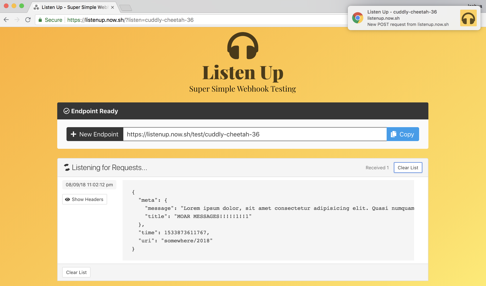

# listen-up

> Super Simple Webhook Listeners - [View Live App](https://listenup.now.sh)



## About

**Listen Up** is a very rudimentary webhook listening platform that will display your `POST` requests to generated endpoints in realtime. This is meant to be useful for prototyping and developing [webhooks](https://en.wikipedia.org/wiki/Webhook).

You can run it locally and tunnel your requests (using [ngrok](https://ngrok.com/)) to port 3030 to see them come through. Or you can deploy it to a platform like hosting platform (I recommend [Zeit Now](https://zeit.co/now)).

You can preview or try the [demo here](https://listenup.now.sh) courtesy of Zeit. :)

## Tooling

This project uses [Feathers](http://feathersjs.com). An open source web framework for building modern real-time applications.

## TODO:

There are a few things I'd like to do yet with this small project.

- Data persistence

  - Right now hooks persist up to 8 hours (without activity) but it lives in a filesystem db called NEDB. This works for a prototype, but is not good long term (maybe switch to a free/tinker tier of a hosted db would be ideal)

- UI Improvements
  - Build an actual front end? ;)
  - Improve Notification system

## Getting Started

Getting up and running is as easy as 1, 2, 3.

1. Make sure you have [NodeJS](https://nodejs.org/) and [npm](https://www.npmjs.com/) installed.
2. Install your dependencies

   ```
   cd path/to/listen-up;

   npm install
   ```

3. Start your app

   ```
   npm start
   ```

## Pull Requests

Sure. If you want to make it better. But really this is just for helping me test and deal with webhooks with work projects.

## Help

For more information on all the things you can do with Feathers visit [docs.feathersjs.com](http://docs.feathersjs.com).

## License

Copyright (c) 2018

Licensed under the [MIT license](LICENSE).
